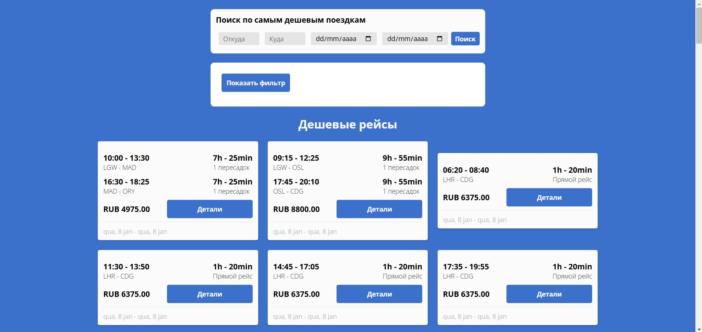
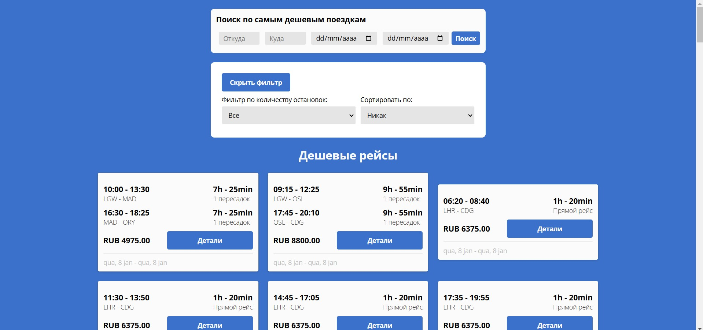
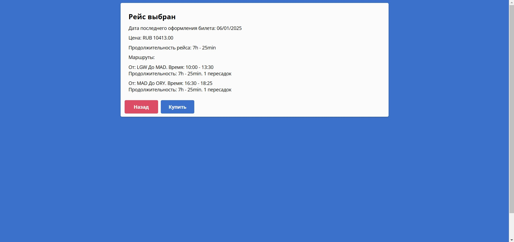

# Приложение для бронирования рейсов

Этот проект представляет собой приложение для бронирования авиабилетов, созданное с использованием React.js, SASS (с проектным стандартом SMACSS) и API авиарейсов Amadeus.

## Технологии:
- **React.js**
- **SASS** (Псроективный стандарт SMACSS)
- **Amadeus Flight API**

## Установка:

1. Клонируйте репозиторий с: [github.com/jordanwmp/flight-booking](https://github.com/jordanwmp/flight-booking)
2. Выполните `npm install`, чтобы установить все зависимости.
3. Запустите приложение командой `npm start`.

## Скриншоты:

- **Главная страница:**
  
  
  
- **Фильтры:**
  
  
  
- **Детали рейса:**
  
  

- **Форма бронирования:**

  

## Функциональные требования:

- **Список доступных рейсов:**
  - Цена
  - Информация о рейсах
  - Информация о пересадках
  - Авиакомпания
  - Продолжительность поездки (если применимо)
  - Даты отправления и прибытия
  - Авиакомпания

- **Фильтры:**
  - По количеству пересадок.

- **Сортировка:**
  - По цене
  - По продолжительности поездки

- **Поиск:**
  - Функциональность поиска рейсов.

- **Карточка рейса:**
  - При нажатии на конкретный рейс открывается страница с детальной информацией о рейсе:
    - Цена
    - Информация о рейсах
    - Пересадки
    - Авиакомпания
    - Продолжительность поездки (если применимо)
    - Даты отправления и прибытия
    - Класс рейса (эконом/бизнес)
    - Информация о багаже (в зависимости от выбранного API)
    - Возможность вернуться к списку рейсов.

- **Бронирование рейса:**
  - Форма с контактными данными.
  - Мокап успешного бронирования при отправке формы.

- **Адаптивный дизайн:**
  - Страница должна адаптироваться к разрешениям 1920px, 1366px, 1024px, 768px, 320px.

## Контакт:
**Email:** jordan.marques@discente.ufma.br

Ваш друг из Бразилии.
